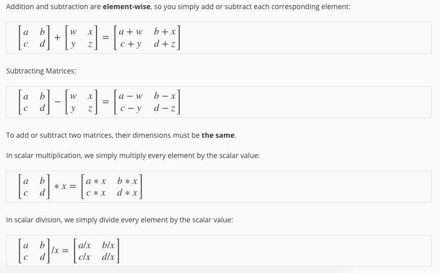
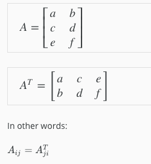

# Matrices and Vectors

Matrices are 2-dimensional arrays:

⎡⎣⎢⎢⎢adgjbehkcfil⎤⎦⎥⎥⎥

The above matrix has four rows and three columns, so it is a 4 x 3 matrix.

A vector is a matrix with one column and many rows:

⎡⎣⎢⎢⎢wxyz⎤⎦⎥⎥⎥

So vectors are a subset of matrices. The above vector is a 4 x 1 matrix.

**Notation and terms**:


Run the cell below to get familiar with the commands in Octave/Matlab. Feel free to create matrices and vectors and try out different things.

```
% The ; denotes we are going back to a new row.
A = [1, 2, 3; 4, 5, 6; 7, 8, 9; 10, 11, 12]

% Initialize a vector 
v = [1;2;3] 

% Get the dimension of the matrix A where m = rows and n = columns
[m,n] = size(A)

% You could also store it this way
dim_A = size(A)

% Get the dimension of the vector v 
dim_v = size(v)

% Now let's index into the 2nd row 3rd column of matrix A
A_23 = A(2,3)
```


# Addition and Scalar Multiplication



```
% Initialize matrix A and B 
A = [1, 2, 4; 5, 3, 2]
B = [1, 3, 4; 1, 1, 1]

% Initialize constant s 
s = 2

% See how element-wise addition works
add_AB = A + B 

% See how element-wise subtraction works
sub_AB = A - B

% See how scalar multiplication works
mult_As = A * s

% Divide A by s
div_As = A / s

% What happens if we have a Matrix + scalar?
add_As = A + s

```


# Matrix-Vector Multiplication

We map the column of the vector onto each row of the matrix, multiplying each element and summing the result.

⎡⎣⎢⎢acebdf⎤⎦⎥⎥∗[xy]=⎡⎣⎢⎢a∗x+b∗yc∗x+d∗ye∗x+f∗y⎤⎦⎥⎥

The result is a **vector**. The number of **columns** of the matrix must equal the number of **rows** of the vector.

An **m x n matrix** multiplied by an **n x 1 vector** results in an **m x 1 vector**.

Below is an example of a matrix-vector multiplication. Make sure you understand how the multiplication works. Feel free to try different matrix-vector multiplications.

```
% Initialize matrix A 
A = [1, 2, 3; 4, 5, 6;7, 8, 9] 

% Initialize vector v 
v = [1; 1; 1] 

% Multiply A * v
Av = A * v


```


# Matrix-Matrix Multiplication

We multiply two matrices by breaking it into several vector multiplications and concatenating the result.

⎡⎣⎢⎢acebdf⎤⎦⎥⎥∗[wyxz]=⎡⎣⎢⎢a∗w+b∗yc∗w+d∗ye∗w+f∗ya∗x+b∗zc∗x+d∗ze∗x+f∗z⎤⎦⎥⎥

An **m x n matrix** multiplied by an **n x o matrix** results in an **m x o** matrix. In the above example, a 3 x 2 matrix times a 2 x 2 matrix resulted in a 3 x 2 matrix.

To multiply two matrices, the number of **columns** of the first matrix must equal the number of **rows** of the second matrix.

For example:

```
% Initialize a 3 by 2 matrix 
A = [1, 2; 3, 4;5, 6]

% Initialize a 2 by 1 matrix 
B = [1; 2] 

% We expect a resulting matrix of (3 by 2)*(2 by 1) = (3 by 1) 
mult_AB = A*B

% Make sure you understand why we got that result
```


# Matrix Multiplication Properties

- Matrices are not commutative: A∗B≠B∗A
- Matrices are associative: (A∗B)∗C=A∗(B∗C)

The **identity matrix**, when multiplied by any matrix of the same dimensions, results in the original matrix. It's just like multiplying numbers by 1. The identity matrix simply has 1's on the diagonal (upper left to lower right diagonal) and 0's elsewhere.

⎡⎣⎢⎢100010001⎤⎦⎥⎥

When multiplying the identity matrix after some matrix (A∗I), the square identity matrix's dimension should match the other matrix's **columns**. When multiplying the identity matrix before some other matrix (I∗A), the square identity matrix's dimension should match the other matrix's **rows**.

```
% Initialize random matrices A and B 
A = [1,2;4,5]
B = [1,1;0,2]

% Initialize a 2 by 2 identity matrix
I = eye(2)

% The above notation is the same as I = [1,0;0,1]

% What happens when we multiply I*A ? 
IA = I*A 

% How about A*I ? 
AI = A*I 

% Compute A*B 
AB = A*B 

% Is it equal to B*A? 
BA = B*A 

% Note that IA = AI but AB != BA
```


# Inverse and Transpose

The **inverse** of a matrix A is denoted A^{-1}A−1. Multiplying by the inverse results in the identity matrix.

A non square matrix does not have an inverse matrix. We can compute inverses of matrices in octave with the pinv(A)pinv(A) function and in Matlab with the inv(A)inv(A) function. Matrices that don't have an inverse are *singular* or *degenerate*.

The **transposition** of a matrix is like rotating the matrix 90**°** in clockwise direction and then reversing it. We can compute transposition of matrices in matlab with the transpose(A) function or A':



```
% Initialize matrix A 
A = [1,2,0;0,5,6;7,0,9]

% Transpose A 
A_trans = A' 

% Take the inverse of A 
A_inv = inv(A)

% What is A^(-1)*A? 
A_invA = inv(A)*A


```

