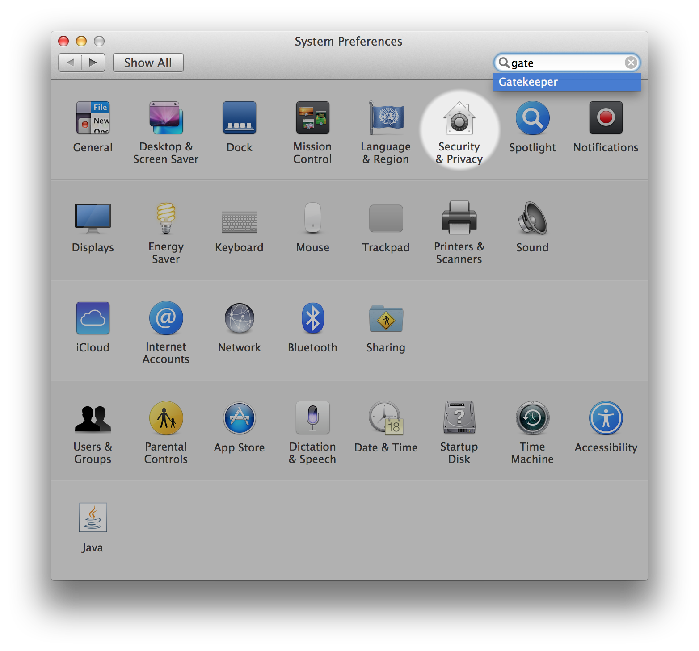
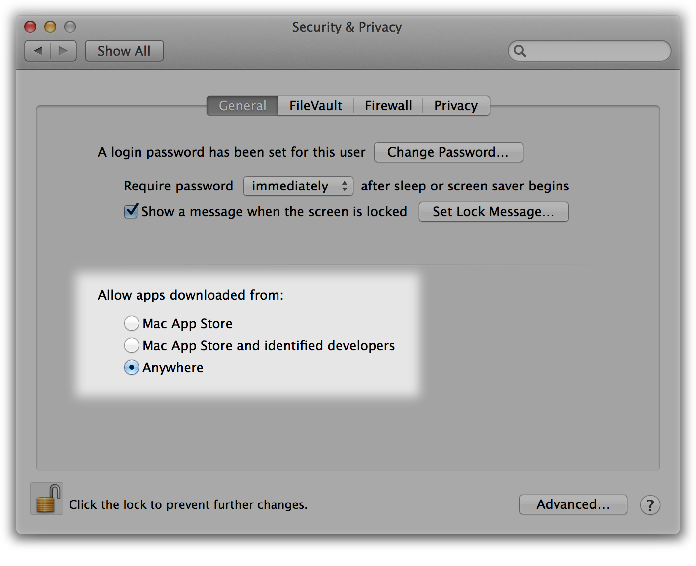

# Setting Up Your Programming Assignment Environment

The Machine Learning course includes several programming assignments which you’ll need to finish to complete the course. The assignments require the Octave or MATLAB scientific computing languages.

- Octave is a free, open-source application available for many platforms. It has a text interface and an experimental graphical one.
- MATLAB is proprietary software, but a free trial license to MATLAB Online is being offered for the completion of this course.

## FAQ

### Does it cost money?

While you’re taking the course, both software packages are available free of charge. Octave is distributed under the GNU Public License, which means that it is always free to download and distribute. MATLAB Online licenses are available for completing the programming assignments in the course only. For any other purposes (like your own work after you complete the course), MATLAB can be licensed to [individuals](https://www.mathworks.com/products/matlab-home.html) or companies from Mathworks directly.

### Is there a difference in quality?

There are several subtle differences between the two software packages. MATLAB may offer a smoother experience (especially for Mac users), contains a larger number of functions, and can be more robust to failure. However, the functions used in this course are available in both packages, and many students have successfully completed the course using either.

### How do I install one of them?

See installation instructions for [Windows](https://www.coursera.org/learn/machine-learning/supplement/p9ckf/installing-octave-matlab-on-windows), [Mac OS X (10.10 Yosemite and 10.9 Mavericks)](https://www.coursera.org/learn/machine-learning/supplement/ykU6M/installing-octave-matlab-on-mac-os-x-10-10-yosemite-and-10-9-mavericks), [other Mac OS X](https://www.coursera.org/learn/machine-learning/supplement/M16Qr/installing-octave-matlab-on-mac-os-x-10-8-mountain-lion-and-earlier), or [GNU/Linux](https://www.coursera.org/learn/machine-learning/supplement/NSG5j/installing-octave-matlab-on-gnu-linux).

## Access MATLAB Online and Upload the Programming Exercise Files

Access to MATLAB Online is being provided by MathWorks to Machine Learning students for the duration of the course. MATLAB Online is the online version of the MATLAB desktop program. It provides most features of the original program in a web-based interface. No download or installation is required, and the program can be accessed from any computer running a common web browser.

### Follow the steps below to access MATLAB Online

1. If you do not already have one, [create a MathWorks account](https://www.mathworks.com/mwaccount/register).
2. Click on the [MATLAB Online license link](https://www.mathworks.com/licensecenter/classroom/machine_learning/) and provide your MathWorks account credentials (if requested).
3. Click on the blue 'Access MATLAB Online' button, and log-in to MATLAB Online with your MathWorks account credentials.
4. Confirm that you have access to MATLAB Online. For help with MATLAB Online access or technical issues, see the MATLAB Help discussion forum.

Bookmark <https://matlab.mathworks.com/> for quicker access to MATLAB Online in the future.

### Follow the steps below to add the programming exercise files to MATLAB Online

Your MathWorks account comes with free cloud storage via [MATLAB Drive](https://drive.matlab.com/) which you can access in MATLAB Online. To add the programming exercise files to MATLAB Online, download the course files as a zip file to your desktop using the link below, then rename the zip file to: **machine-learning-ex** (Coursera adds a prefix the filename upon download that must be removed)

[machine-learning-ex.zip.zip](https://d3c33hcgiwev3.cloudfront.net/9pV8lAVdEemYdRIT0BhLtg_f6a8b620055d11e98bc44d5f29affbc8_machine-learning-ex.zip?Expires=1546214400&Signature=PxhZaIYKa0JTOiAGJt2jdBW~8BffwAzji0QJqnejcjewuasVzp838TqQGA4k7LnG0bKnE0XZwxyb~umk-z6n44nDHvWhioJE-RvGof2t4ZfIDPH~3jNZDK3ILycZTozp82XIkf9EIKRfdRgKL2KDf5N0fgnS78onOShNu-E5gxo_&Key-Pair-Id=APKAJLTNE6QMUY6HBC5A)

To add the course files to MATLAB Online,

1. Open MATLAB Online and click the 'Upload' button in the 'Home' tab.
2. Use the folder window that opens to find and select the 'machine-learning-ex.zip' file, then click 'Open'. You should see the file in MATLAB Online after upload is complete.
3. Unzip the file by entering the command: **unzip machine-learning-ex.zip** at the command line.

Note that you can access your files even after your MATLAB Online license expires through MATLAB Drive.

### Completing the programming exercises in MATLAB Online

The exercise files added to your MATLAB Drive by following the steps above have been updated specifically for MATLAB Online users. Instructions for completing the programming exercises in MATLAB Online are found in the **README.mlx** file in the ‘machine-learning-ex’ folder. Before attempting a programming exercise, make sure that you read and follow the instructions in **README.mlx**, which differ from the instructions and demonstration provided in the course- those instructions apply only to Octave and MATLAB Desktop users.

# Installing Octave on Windows

## Installing Octave on Windows

**Use this link to install Octave for windows:** <http://wiki.octave.org/Octave_for_Microsoft_Windows>

**Octave on Windows can be used to submit programming assignments** in this course but will likely need a patch provided in the discussion forum. Refer to [https://www.coursera.org/learn/machine-learning/discussions/vgCyrQoMEeWv5yIAC00Eog?](https://www.coursera.org/learn/machine-learning/discussions/vgCyrQoMEeWv5yIAC00Eog?page=2) for more information about the patch for your version.

"**Warning:** Do not install Octave 4.0.0"; checkout the "Resources" menu's section of "Installation Issues".

# Installing Octave on Mac OS X (10.10 Yosemite and 10.9 Mavericks)

## Installing Octave on Mac OS X (10.10 Yosemite and 10.9 Mavericks)

Mac OS X [has a feature called Gatekeeper](http://support.apple.com/en-us/HT202491) that may only let you install applications from the Mac App Store. You may need to configure it to allow the Octave installer. Visit your System Preferences, click Security & Privacy, and check the setting to allow apps downloaded from Anywhere. You may need to enter your password to unlock the settings page.

\2. Download [the Octave 3.8.0 installer](http://sourceforge.net/projects/octave/files/Octave%20MacOSX%20Binary/2013-12-30%20binary%20installer%20of%20Octave%203.8.0%20for%20OSX%2010.9.1%20%28beta%29/GNU_Octave_3.8.0-6.dmg/download) or the latest version that isn't 4.0.0. The file is large so this may take some time.

\3. Open the downloaded image, probably named *GNU_Octave_3.8.0-6.dmg* on your computer, and then open *Octave-3.8.0-6.mpkg* inside.

\4. Follow the installer’s instructions. You may need to enter the administrator password for your computer.

\5. After the installer completes, Octave should be installed on your computer. You can find *Octave-cli* in your Mac’s Applications, which is a text interface for Octave that you can use to complete Machine Learning’s programming assignments.

Octave also includes an experimental graphical interface which is called *Octave-gui*, also in your Mac’s Applications, but we recommend using *Octave-cli* because it’s more stable.

Note: If you use a package manager (like MacPorts or Homebrew), we recommend you follow [the package manager installation instructions](http://wiki.octave.org/Octave_for_MacOS_X#Package_Managers).

"**Warning:** Do not install Octave 4.0.0"; checkout the "Resources" menu's section of "Installation Issues".

# Installing Octave on Mac OS X (10.8 Mountain Lion and Earlier)

## Installing Octave on Mac OS X (10.8 Mountain Lion and Earlier)

If you use Mac OS X 10.9, we recommend following the [instructions above](https://www.coursera.org/learn/machine-learning/supplement/ykU6M/installing-octave-matlab-on-mac-os-x-10-10-yosemite-and-10-9-mavericks). For other Mac OS X versions, the Octave project doesn’t distribute installers. We recommend installing Homebrew, a package manager, using [their instructions](http://wiki.octave.org/Octave_for_MacOS_X#Homebrew).

"**Warning:** Do not install Octave 4.0.0"; checkout the "Resources" menu's section of "Installation Issues".

# #

# Installing Octave on GNU/Linux

## Installing Octave on GNU/Linux

We recommend [using your system package manager to install Octave](http://wiki.octave.org/Octave_for_GNU/Linux).

On Ubuntu, you can use:

- *sudo apt-get update && sudo apt-get install octave*

On Fedora, you can use:

- *sudo yum install octave-forge*

Please consult [the Octave maintainer’s instructions](http://wiki.octave.org/Octave_for_GNU/Linux) for other GNU/Linux systems.

"**Warning:** Do not install Octave 4.0.0"; checkout the "Resources" menu's section of "Installation Issues".

# More Octave/MATLAB resources

## Octave Resources

At the Octave command line, typing **help** followed by a function name displays documentation for a built-in function. For example, **help plot** will bring up help information for plotting. Further documentation can be found at the Octave [documentation pages](http://www.gnu.org/software/octave/doc/interpreter/).

## MATLAB Resources

At the MATLAB command line, typing help followed by a function name displays documentation for a built-in function. For example, help plot will bring up help information for plotting. Further documentation can be found at the MATLAB [documentation pages](http://www.mathworks.com/help/matlab/).

## Introduction to MATLAB with Onramp

Made for MATLAB beginners or those looking for a quick refresh, the MATLAB Onramp is a 1-2 hour interactive introduction to the basics of MATLAB programming. **Octave users are also welcome to use Onramp** (requires creation of a free MathWorks account). To access Onramp:

1.	If you don’t already have one, create a MathWorks account at: <https://www.mathworks.com/mwaccount/register>

2.	Go to: <https://matlabacademy.mathworks.com/> and click on the MATLAB Onramp button to start learning MATLAB!

## MATLAB Programming Tutorials

These short tutorial videos introduce MATLAB and cover various programming topics used in the assignments. Feel free to watch some now and return to reference them as you work through the programming assignments. Many of the topics below are also covered in MATLAB Onramp. ***Indicates content covered in Onramp.**

### Get Started with MATLAB and MATLAB Online

- [What is MATLAB?](https://youtu.be/WYG2ZZjgp5M)*
- [MATLAB Variables](https://youtu.be/0w9NKt6Fixk)*
- [MATLAB as a Calculator](https://youtu.be/aRSkNpCSgWY)*
- [MATLAB Functions](https://youtu.be/RJp46UVQBic)*
- [Getting Started with MATLAB Online](https://youtu.be/XjzxCVWKz58)
- [Managing Files in MATLAB Online](https://youtu.be/B3lWLIrYjC0)

### Vectors

- [Creating Vectors](https://youtu.be/R5Mnkrk9Mos)*
- [Creating Uniformly Spaced Vectors](https://youtu.be/_zqTOV5yl8Y)*
- [Accessing Elements of a Vector Using Conditions](https://youtu.be/8D04GW_foQ0)*
- [Calculations with Vectors](https://youtu.be/VQaZ0TvjF0c)*
- [Vector Transpose](https://youtu.be/vgRLwjHBmsg)

### Visualization

- [Line Plots](https://youtu.be/-hhJoveE4sY)*
- [Annotating Graphs](https://youtu.be/JyovEGPSdoI)*
- [Multiple Plots](https://youtu.be/fBx8EFuXFLM)*

### Matrices

- [Creating Matrices](https://youtu.be/qdTdwTh6jMo)*
- [Calculations with Matrices](https://youtu.be/mzzJ9gnMrYE)*
- [Accessing Elements of a Matrix](https://youtu.be/uWPHxpTuZRA)*
- [Matrix Creation Functions](https://youtu.be/VPcbpVd_mPA)*
- [Combining Matrices](https://youtu.be/ejTr3ekTTyA)
- [Determining Array Size and Length](https://youtu.be/IF9-ffmxuy8)
- [Matrix Multiplication](https://youtu.be/4hsx3bdNjGk)
- [Reshaping Arrays](https://youtu.be/UQpDIHlFo8A)
- [Statistical Functions with Matrices](https://youtu.be/Y97W3_u7cM4)

### MATLAB Programming

- [Logical Variables](https://youtu.be/bRMg4GsFDQ8)*
- [If-Else Statements](https://youtu.be/JZSuU-Laigo)*
- [Writing a FOR loop](https://youtu.be/lg65bzgvI5c)*
- [Writing a WHILE Loop](https://youtu.be/PKH5lCMJXbk)
- [Writing Functions](https://youtu.be/GrcNN04eqXU)
- [Passing Functions as Inputs](https://youtu.be/aNCwR9dRjHs)

### Troubleshooting

- [Using Online Documentation](https://youtu.be/54n5zJwR8aM)*
- [Which File or Variable Am I Using?](https://youtu.be/Z09BvGeYNdE)
- [Troubleshooting Code with the Debugger](https://youtu.be/DB4aJMnZtNQ)