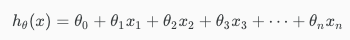
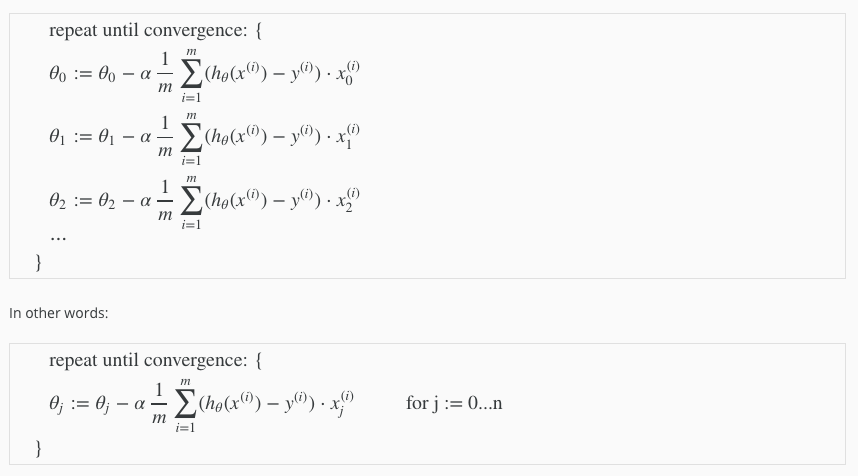
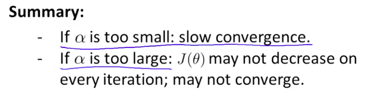
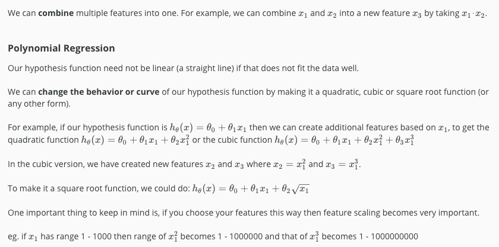

# Multiple Features

**Note:** [7:25 - \theta^TθT is a 1 by (n+1) matrix and not an (n+1) by 1 matrix]

Linear regression with multiple variables is also known as "multivariate linear regression".

We now introduce notation for equations where we can have any number of input variables.

x(i)jx(i)mn=value of feature j in the ith training example=the input (features) of the ith training example=the number of training examples=the number of features

The multivariable form of the hypothesis function accommodating these multiple features is as follows:

In order to develop intuition about this function, we can think about \theta_0θ0 as the basic price of a house, \theta_1θ1 as the price per square meter, \theta_2θ2 as the price per floor, etc. x_1x1 will be the number of square meters in the house, x_2x2 the number of floors, etc.

Using the definition of matrix multiplication, our multivariable hypothesis function can be concisely represented as:

hθ(x)=[θ0θ1...θn]⎡⎣⎢⎢⎢⎢x0x1⋮xn⎤⎦⎥⎥⎥⎥=θTx

This is a vectorization of our hypothesis function for one training example; see the lessons on vectorization to learn more.

# Gradient Descent For Multiple Variables

## **Gradient Descent for Multiple Variables**

The gradient descent equation itself is generally the same form; we just have to repeat it for our 'n' features:

The following image compares gradient descent with one variable to gradient descent with multiple variables:

# Gradient Descent in Practice I - Feature Scaling

**Feature scaling 的功能：让原来的feature的变化范围均一化，这样有助于加快gradient descent的速度**

Note:** [6:20 - The average size of a house is 1000 but 100 is accidentally written instead]

We can speed up gradient descent by having each of our input values in roughly the same range. This is because θ will descend quickly on small ranges and slowly on large ranges, and so will oscillate inefficiently down to the optimum when the variables are very uneven.

The way to prevent this is to modify the ranges of our input variables so that they are all roughly the same. Ideally:

These aren't exact requirements; we are only trying to speed things up. The goal is to get all input variables into roughly one of these ranges, give or take a few.

Two techniques to help with this are **feature scaling** and **mean normalization**. Feature scaling involves dividing the input values by the range (i.e. the maximum value minus the minimum value) of the input variable, resulting in a new range of just 1. Mean normalization involves subtracting the average value for an input variable from the values for that input variable resulting in a new average value for the input variable of just zero. To implement both of these techniques, adjust your input values as shown in this formula:

Where μ_iμi is the **average** of all the values for feature (i) and s_isi is the range of values (max - min), or s_isi is the standard deviation.

Note that dividing by the range, or dividing by the standard deviation, give different results. The quizzes in this course use range - the programming exercises use standard deviation.

For example, if x_ixi represents housing prices with a range of 100 to 2000 and a mean value of 1000, then, 

**How to choose α?**

J(θ) should decrease every iteration

# Gradient Descent in Practice II - Learning Rate

**Note:** [5:20 - the x -axis label in the right graph should be \thetaθ rather than No. of iterations ]

**Debugging gradient descent.** Make a plot with *number of iterations* on the x-axis. Now plot the cost function, J(θ) over the number of iterations of gradient descent. If J(θ) ever increases, then you probably need to decrease α.

**Automatic convergence test.** Declare convergence if J(θ) decreases by less than E in one iteration, where E is some small value such as 10−3. However in practice it's difficult to choose this threshold value.

It has been proven that if learning rate α is sufficiently small, then J(θ) will decrease on every iteration.

To summarize:

If \alphaα is too small: slow convergence.

If \alphaα is too large: may not decrease on every iteration and thus may not converge.

# Features and Polynomial Regression

We can improve our features and the form of our hypothesis function in a couple different ways.

