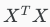

# Normal Equation

**Note:** [8:00 to 8:44 - The design matrix X (in the bottom right side of the slide) given in the example should have elements x with subscript 1 and superscripts varying from 1 to m because for all m training sets there are only 2 features x_0x0 and x_1x1. 12:56 - The X matrix is m by (n+1) and NOT n by n. ]

Gradient descent gives one way of minimizing J. Let’s discuss a second way of doing so, this time performing the minimization explicitly and without resorting to an iterative algorithm. In the "Normal Equation" method, we will minimize J by explicitly taking its derivatives with respect to the θj ’s, and setting them to zero. This allows us to find the optimum theta without iteration. The normal equation formula is given below:

X 包含所有的features，第一列是额外的一列1，X: m*(n+1), y:m*1

There is **no need** to do feature scaling with the normal equation.

The following is a comparison of gradient descent and the normal equation:

| Gradient Descent           | Normal Equation                                              |
| -------------------------- | ------------------------------------------------------------ |
| Need to choose alpha       | No need to choose alpha                                      |
| Needs many iterations      | No need to iterate                                           |
| O (kn^2)                   | O (n^3), need to calculate inverse of  |
| Works well when n is large | Slow if n is very large                                      |

With the normal equation, computing the inversion has complexity \mathcal{O}(n^3). So if we have a very large number of features, the normal equation will be slow. In practice, when n exceeds 10,000 it might be a good time to go from a normal solution to an iterative process.

# Normal Equation Noninvertibility

