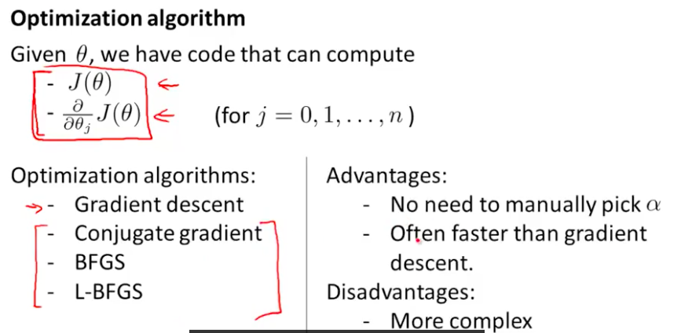
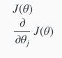
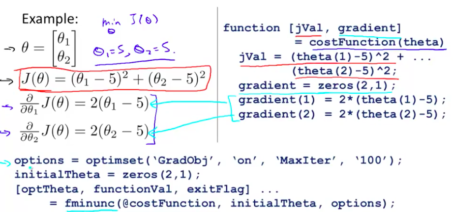
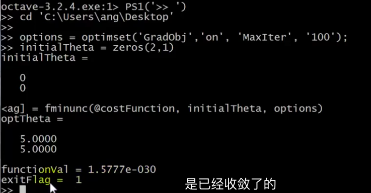

# Cost Function

We cannot use the same cost function that we use for linear regression because the Logistic Function will cause the output to be wavy, causing many local optima. In other words, it will not be a convex function.

Instead, our cost function for logistic regression looks like:


If our correct answer 'y' is 0, then the cost function will be 0 if our hypothesis function also outputs 0. If our hypothesis approaches 1, then the cost function will approach infinity.

If our correct answer 'y' is 1, then the cost function will be 0 if our hypothesis function outputs 1. If our hypothesis approaches 0, then the cost function will approach infinity.

Note that writing the cost function in this way guarantees that J(θ) is convex for logistic regression.

# Simplified Cost Function and Gradient Descent

**Note:** [6:53 - the gradient descent equation should have a 1/m factor]

We can compress our cost function's two conditional cases into one case:


### **Gradient Descent**

Remember that the general form of gradient descent is:


# Advanced Optimization

**Note:** [7:35 - '100' should be 100 instead. The value provided should be an integer and not a character string.]

"Conjugate gradient", "BFGS", and "L-BFGS" are more sophisticated, faster ways to optimize θ that can be used instead of gradient descent. 



这三种方法有一个linear search的内置算法，每一轮迭代都会选择不同的学习率α来更新参数，不需要手动选择α

We suggest that you should not write these more sophisticated algorithms yourself (unless you are an expert in numerical computing) but use the libraries instead, as they're already tested and highly optimized. Octave provides them.

We first need to provide a function that evaluates the following two functions for a given input value θ:



We can write a single function that returns both of these:

```matlab
function [jVal, gradient] = costFunction(theta)

  jVal = [...code to compute J(theta)...];

  gradient = [...code to compute derivative of J(theta)...];

end
```

Then we can use octave's "fminunc()" optimization algorithm along with the "optimset()" function that creates an object containing the options we want to send to "fminunc()". (Note: the value for MaxIter should be an integer, not a character string - errata in the video at 7:30)

```matlab
options = optimset('GradObj', 'on', 'MaxIter', 100);

initialTheta = zeros(2,1);

   [optTheta, functionVal, exitFlag] = fminunc(@costFunction, initialTheta, 
     options);
```

We give to the function "fminunc()" our cost function, our initial vector of theta values, and the "options" object that we created beforehand.





exitflag=1 表示函数收敛

