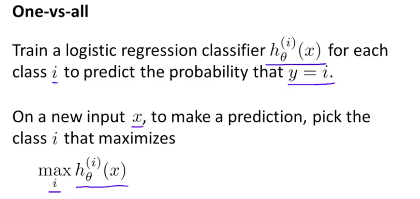

# Multiclass Classification: One-vs-all

Now we will approach the classification of data when we have more than two categories. Instead of y = {0,1} we will expand our definition so that y = {0,1...n}.

Since y = {0,1...n}, we divide our problem into n+1 (+1 because the index starts at 0) binary classification problems; in each one, we predict the probability that 'y' is a member of one of our classes.

根据类别的数目，设置不同的分类器，然后取所有分类器的最大预测值的对应的类别

We are basically choosing one class and then lumping all the others into a single second class. We do this repeatedly, applying binary logistic regression to each case, and then use the hypothesis that returned the highest value as our prediction.

The following image shows how one could classify 3 classes:

**To summarize:**

Train a logistic regression classifier h_\theta(x)hθ(x) for each class to predict the probability that  y = i .

To make a prediction on a new x, pick the class that maximizes h_\theta (x)hθ(x)